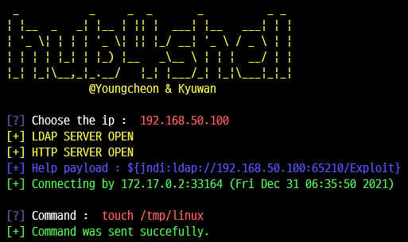

# hub4shell
> Python 기반 Log4j 취약점 공격 도구



## 요구사항

Python 3.9

JDK


## 사용법
```sh
git clone https://github.com/ch3ony/hub4shell.git
cd hub4shell
pip install -r requirements.txt
python main.py
```


## 업데이트 내역

* 1.1
    * README 추가
* 1.0
    * 개발 완료

## 정보

최영천 – ch3ony@gmail.com

김규완 - rla9826@naver.com

## 기여 방법

1. (<https://github.com/ch3ony/hub4shell/fork>)을 포크합니다.
2. (`git checkout -b feature/fooBar`) 명령어로 새 브랜치를 만드세요.
3. (`git commit -am 'Add some fooBar'`) 명령어로 커밋하세요.
4. (`git push origin feature/fooBar`) 명령어로 브랜치에 푸시하세요. 
5. 풀리퀘스트를 보내주세요.